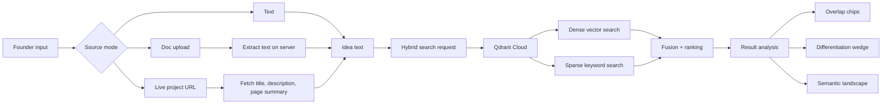
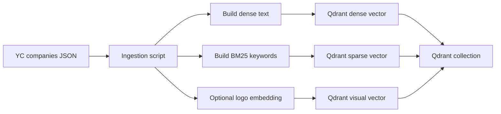

# IdeaRadar

IdeaRadar helps founders compare a startup idea against a real market corpus. It is not a chatbot. It is a search-and-compare app that uses Qdrant to surface similar companies, explain overlap, and suggest a sharper wedge.

## What it does

- Paste an idea into the text box.
- Upload a document: `DOCX`, `TXT`, `MD`, `Markdown`, `JSON`, or `CSV`.
- Paste a live project URL and extract the page title, description, and visible text.
- Search a real YC company corpus indexed in Qdrant Cloud.
- See the closest matches, why they overlap, what differs, and how to position the idea better.
- Review a semantic landscape, saturation meter, and top-three comparison panel.

## Why it stands out

- No chatbot loop.
- Real Qdrant-backed retrieval.
- Clear source-mode UX: one input path at a time.
- Founder-friendly competitive analysis instead of raw similarity scores.

## Architecture



## Search flow

1. The user chooses one source mode.
2. The app converts that source into normalized idea text.
3. The search API sends the text to Qdrant Cloud.
4. Qdrant retrieves matches using dense + sparse hybrid search.
5. The app runs a lightweight analysis pass to explain:
   - why the match is similar
   - what is different
   - what wedge to use

## Data pipeline



## Stack

- Next.js 16
- TypeScript
- Qdrant Cloud
- Qdrant Cloud Inference for dense embeddings
- BM25 sparse retrieval
- Local CLIP embedding for optional logo/vector support

## Source modes

Choose one way to search at a time:

- `Text`
- `Doc upload`
- `Live project URLs`

The inactive inputs are muted so the flow stays clean.

## Setup

1. Install dependencies.
2. Copy `.env.example` to `.env.local`.
3. Add your Qdrant Cloud values.
4. Start the app:

```powershell
npm run dev
```

## Corpus ingestion

The corpus is a YC company dataset stored offline in `data/yc-companies-all.json`.

To index it into Qdrant Cloud:

```powershell
npm run ingest:yc
```

## Environment

Minimum required environment values:

```env
QDRANT_URL=https://your-qdrant-cloud-cluster-url:6333
QDRANT_API_KEY=your_qdrant_cloud_key
QDRANT_COLLECTION=idea_radar_yc_companies
QDRANT_INFERENCE_MODEL=sentence-transformers/all-MiniLM-L6-v2
QDRANT_SPARSE_MODEL=qdrant/bm25
```

## Demo flow

1. Open the deployed app.
2. Pick a source mode.
3. Paste the idea, upload a doc, or paste a live project URL.
4. Click **Find Similar Companies**.
5. Review the result cards, semantic landscape, saturation meter, and comparison panel.

## Future plan

- Voice-to-text input for idea capture.
- Better comparison and wedge explanations.
- Expanded source support if needed later.

